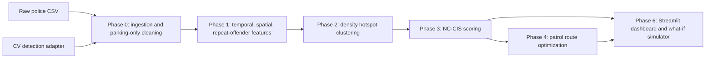

# Gridlock Parking Congestion Intelligence

AI-driven parking intelligence prototype for the Flipkart Gridlock hackathon theme: poor visibility on parking-induced congestion.

The core differentiator is **NC-CIS: Network-Centrality-Weighted Congestion Impact Score**. Instead of ranking locations only by violation density, NC-CIS combines:

- violation density
- estimated capacity-loss pressure
- temporal recurrence
- graph betweenness centrality

This reframes illegal parking as a network-resilience problem: a dense illegal-parking pocket on a highly central road segment should be prioritized before the same density on a low-impact side street.

## Current Dataset Run

These values are computed from `jan to may police violation_anonymized791b166.csv` by `src/ingestion/clean_data.py`.

- Raw records: 298,450
- Parking-only exploded violation events: 338,907
- Unique source records containing parking violations: 298,282
- Unique GPS points rounded to 6 decimals: 208,311
- Date range: 2023-11-09 19:11:46+00:00 to 2024-04-08 17:30:46+00:00
- Closure/action tracking rate: 0.00%
- Median validation lag: 31.04 hours
- Mean validation lag: 96.78 hours
- `No Junction` share: 49.55%
- Daytime enforcement share, 09:00-17:59: 2.04%
- Overnight enforcement share, 00:00-07:59: 64.37%
- Vehicles with 5+ recorded parking violations: 3,489
- Highest repeat-offender count: 55

Interpretation: low daytime volume is treated as an enforcement visibility blind spot, not proof that daytime illegal parking is absent.

## Architecture



## Repo Layout

- `src/ingestion/clean_data.py`: validates schema, parses JSON violation lists, filters parking violations, writes cleaned parquet and reactivity stats.
- `src/features/build_features.py`: creates grid-cell features, temporal blind-spot chart, repeat-offender table.
- `src/clustering/detect_hotspots.py`: hotspot clustering. It uses HDBSCAN when installed; otherwise it uses a haversine DBSCAN grid fallback.
- `src/scoring/nc_cis.py`: NC-CIS engine. It uses an offline hotspot k-nearest-neighbor graph for betweenness centrality, which keeps the demo runnable without a live OSM download.
- `src/optimization/patrol_optimizer.py`: simulated multi-unit patrol routing against top NC-CIS hotspots, compared with a raw-density baseline.
- `src/cv/ingest_detection.py`: narrow CV proof-of-concept adapter that writes illegal-parking detection events into the same schema family.
- `dashboard/app.py`: Streamlit dashboard with NC-CIS map, what-if removal, patrol routes, temporal blind spot, and repeat offenders.

## Run

For detailed setup, pipeline, dashboard, and test commands, see [`RUN_INSTRUCTIONS.md`](RUN_INSTRUCTIONS.md).

The bundled Codex Python runtime used during this build is:

```powershell
& "C:\Users\ayush\.cache\codex-runtimes\codex-primary-runtime\dependencies\python\python.exe" -m src.run_pipeline
```

With a normal Python setup:

```powershell
python -m pip install -r requirements.txt
python -m src.run_pipeline
python -m streamlit run dashboard/app.py
```

Optional HDBSCAN, OSMnx, and YOLO support:

```powershell
python -m pip install -r requirements-optional.txt
```

If `streamlit.exe` is not on PATH, run it through Python:

```powershell
python -m streamlit run dashboard/app.py
```

## Generated Outputs

- `data/processed/parking_violations_clean.parquet`
- `data/processed/location_features.parquet`
- `data/processed/repeat_offenders.parquet`
- `data/processed/hotspots.parquet`
- `data/processed/ranked_hotspots.parquet`
- `data/processed/patrol_routes.parquet`
- `reports/reactivity_stats.md`
- `reports/feature_findings.md`
- `reports/figures/hour_of_day_blind_spot.html`
- `reports/figures/hotspots_static_map.html`
- `reports/figures/nc_cis_hotspots.html`
- `reports/figures/patrol_routes.html`

## Modeling Notes

The current demo uses a 120-meter haversine DBSCAN fallback over aggregated spatial grid cells because HDBSCAN and OSMnx are optional heavy dependencies on Windows. This is explicitly documented rather than hidden: the architecture supports swapping in HDBSCAN and OSMnx road-edge snapping when those dependencies are available.

The patrol coverage improvement is a simulated comparison, not a field-tested claim. Current run: top-30 NC-CIS routing produces a 23.17% higher NC-CIS coverage score than choosing the top-30 hotspots by raw density alone.
